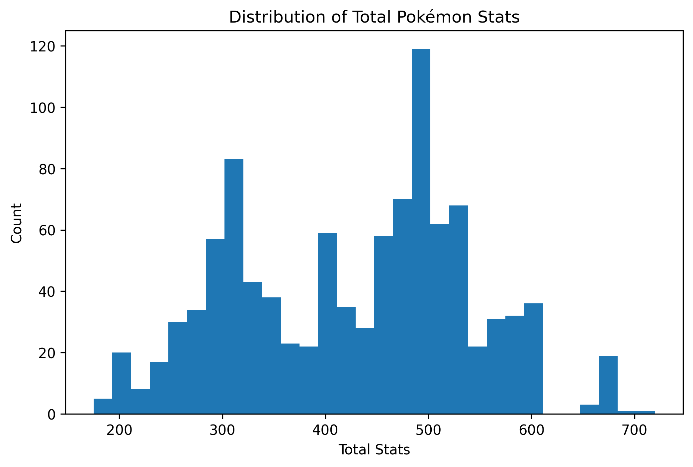
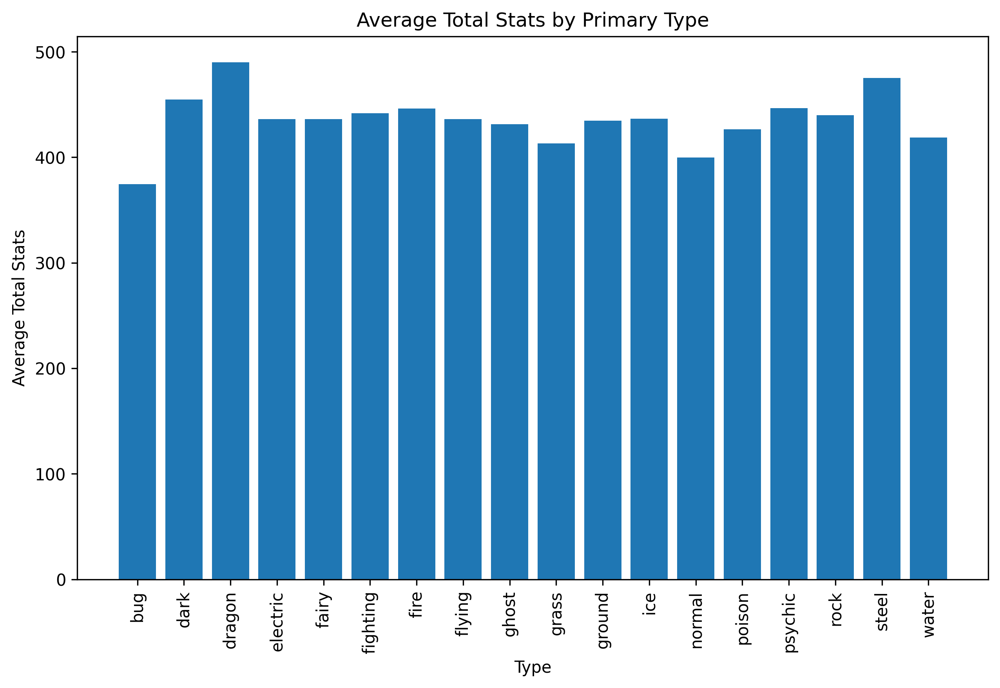
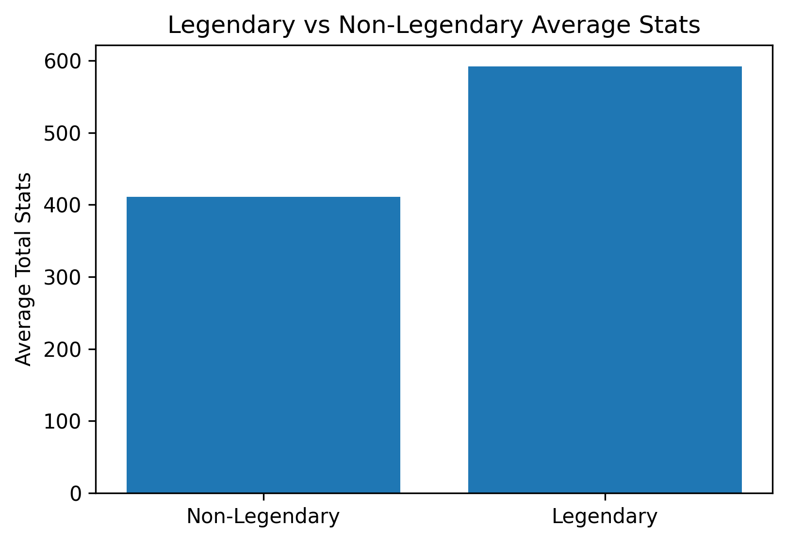
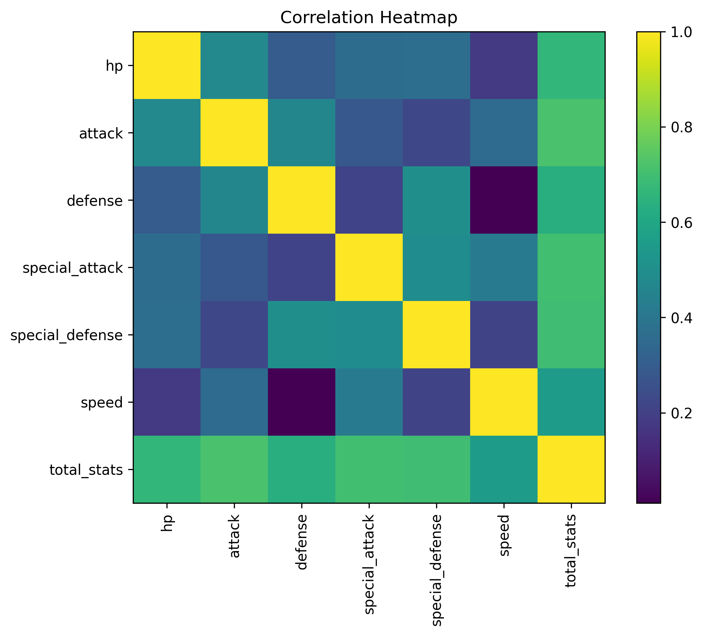
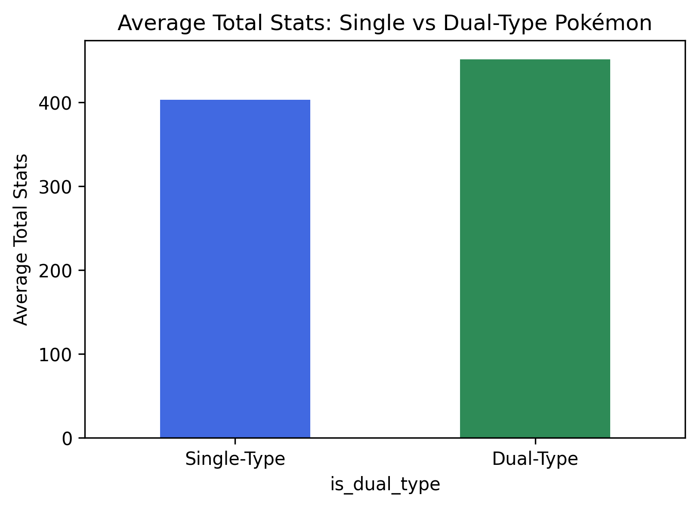
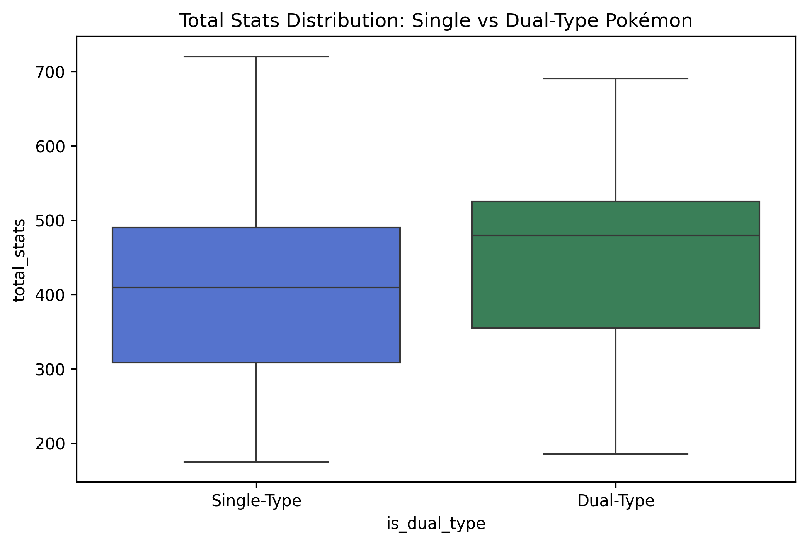
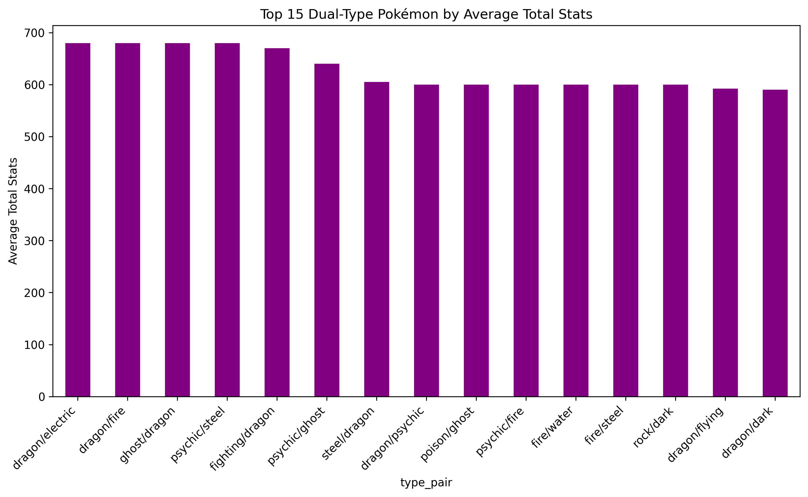
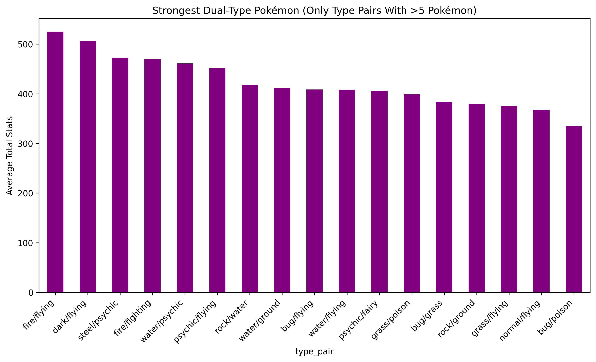

# What Makes a Pokémon Strong?
### Exploring Over 1,000 Pokémon Using the PokeAPI  
*By Anton Hinckley — STAT 386*

## Introduction

Pokemon had been a worlwide phenomenon for nearly three decades, on top of its huge amount of popularity driven by its games and TV shows, Pokemon also provides a suprisingly rich numerical dataset. Each Pokemon has detailed stats such as HP, Speed, Attack, Defense, and more. These stats form the foundation of gameplay, in both video games and card games, and competitive battling, making them a great candidate for statistical exploration.

For this project, I wanted to take somehting fun and nostalgic and turn it into an example of data acquisition. Using the [PokeAPI](https://pokeapi.co/docs/v2), a free publicly accessible dataset with information about all Pokemon games, cards, and lore. I built a dataset of all 1,025 Pokemon and analyzed what characteristics contribute to overall card strenght.

### Motivating Question

My main goal was to explore the following question:

Which Pokemon stats best predict total combat strenght?

I explore this by looking at a couple of questions. What base stat correlates the most to overall stat strength? Are legendary Pokemon actually better across all stats? How do different Pokemon types compare? Does being a dual-type come with an advantage?

These questions gave me plenty of angles for visualization, summaries, correlations, and comparison across subgroups.

## Ethics and API Use

Because PokeAPI is a free, public REST API, all data collection is completely legal and ethical. No scraping of copyright HTML was required, and the API's documentation explicitly allows educational use (hooray).

To implelment good API etiquette, I used a small delay between requests to avoid rate-limiting, added retry logic to handle occassional failed responses with a waiting time to ensure rate-limiting wasn't overran, stored partial results to avoid hammering the API repeatedly. This ensured that I accessed the data respectfully.

## How I Gathered the Data

https://pokeapi.co/docs/v2 provided the documentation to make API calls necessary for gathering all of the data.

### Step 1 - Retrieve Pokemon Basic Data

For Pokemon IDs 1 through 1025 (all pokemon):
* Send a request to: https://pokeapi.co/api/v2/pokemon/{id}
* Extact:
    * Name
    * Types (primary & secondary)
    * Height & weight
    * Base stats (HP, Attack, Defense)

### Step 2 - Retrieve Legendary Status

The basic endpoint does not tell you whether a Pokemon is legendary.

For that, you must call the species endpoint which is provided in the basic endpoint:
```{Python}
data["species"]["url"]
```
* This code is another API request
* Extact legendary and mythical status

### Step 3 - Handle Failures Gracefully

Some requests occasionaly fail due to network hiccups, API rate limits, and invalid JSON responses.

To manage this I incoporated retry logic, skipped bad responses instead of crashing, added logic to wait incase of error to not exceed API rate limits, and saved partial progress every 50 Pokemons.

### Step 4 - Cleaning

Onec the raw data was collected, I formatted names, replaced missing secondary types with "None", Calculated total_stat = sum of all base stats, and saved a cleaned CSV ready for EDA. All code is available in my GitHub repository at the end of the post.

You run the code by running the following two files in this order: python-files/retrieve_pokemon.py and python-files/clean_pokemon.py

## EDA highlights

My final dataset contained: 1,025 Pokemons, with 13 variables.

### 1. Distribution of Total Stats

A histogram of total stats clearly showed:
* Most Pokemon cluster around one of two clusters at 320ish and 500ish


### 2. Which Types Are Strongest?

I computed average total stats for each primary type.

Top types by average total stats:
1. Dragon
2. Steel
3. Psychic
4. Ice

Lowest types by average total stats:
1. Bug
2. Normal
3. Grass
4. Water



If you look at the histogram above, you'll see that there is a huge difference between Bug and other types being severely weaker than any other type by a large amount.

### 3. Legendary Pokemon Analysis

When comparing legendary vs. non-legendary Pokemon:

| Group |  Average Total Statistics |
| :---------- | ----------: |
| Non-Legendary | ~450 |
| Legendary | ~650 |



Legendaries were, on average, 200 points stronger conirming the huge gap intedned by game balance.

### 4. Correlation Insights

A correlation heatmap revealed: Total stats correlates most strongly with attack stat. Additionally, total stats correlates the least with speed suggesting that high speed often doesn't mean high overall stats. 



This suggests that while Speed is important competitively, it doesn't heavily influence overall stats as measured by total stat sum.

### 5. Dual-Type vs Single-Type Pokemon

Preliminary comparisons showed: 
* Dual-type Pokemon have slightly higher total stats on average
* Dual-type Pokemon have less variation 




All of the Top 5 Dual-Types had a Steel or Dragon type, which are the strongest primary type. Most of the weakest dual-types had bug as a type



I took all of the dual-types with over 5 Pokemons and unsuprisingly the weakest types include normal, bug and grass. 



### Resources & Further Reading
* [PokeAPI Documentation](https://pokeapi.co/docs/v2)
* [My GitHub Repo](https://github.com/ThatTwoDude/pokemon-comparison)
